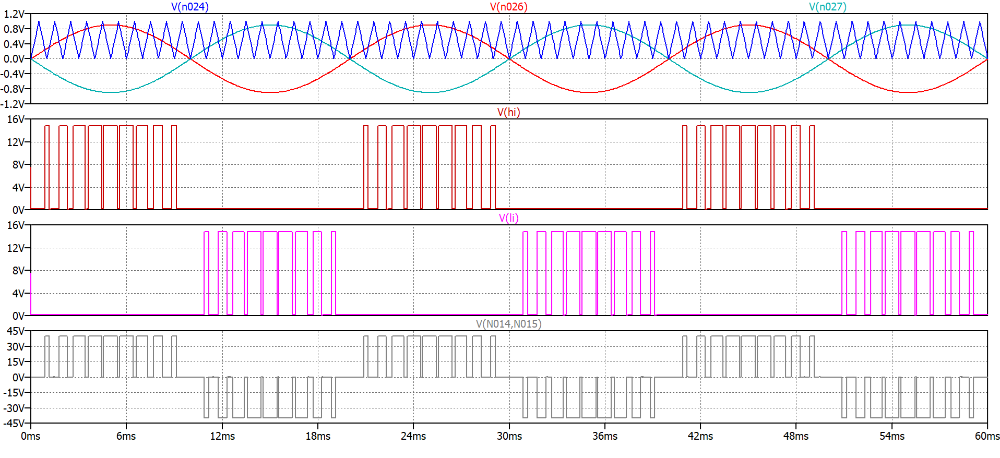

# Single-Phase H-Bridge Inverter Simulation

This repository contains a transient simulation of a single-phase H-bridge inverter circuit built and tested in LTspice. 

The project demonstrates the conversion of a DC voltage source into an AC output using Sinusoidal Pulse Width Modulation (SPWM) control logic and real gate driver circuit characteristics.

## Circuit Features & Parameters
- **Topology:** Full H-Bridge inverter using 4 power MOSFET switches.
- **Control Strategy:** Sinusoidal Pulse Width Modulation (SPWM).
- **Simulation Run Time:** 600 ms (Steady-state achieved).
- **Output Target:** Pure/Filtered alternating current (AC) across an inductive load.

## Control Logic: SPWM (Sinusoidal PWM)
The switching signals for the high-side and low-side MOSFETs are generated by comparing:
1. A low-frequency **reference sine wave** (representing the desired output AC frequency, e.g. 50Hz).
2. A high-frequency **triangular carrier wave** (dictating the switching frequency of the inverter, e.g. 1000Hz).

The overlap between these two waves controls the width of the pulses delivered via the gate driver circuit to turn the diagonally opposite switches ($S_1, S_4$ and $S_2, S_3$) on and off.

## Key Simulation Waveforms
*(Tip: Replace these placeholders with your actual screenshots later!)*

### 1. Schematic

### 2. SPWM Generation Logic

*Showing the intersection of the reference sine wave and triangular carrier wave alongside the gate control pulses.*

### 3. Load Output Voltage and Current

*Showing the chopped output voltage and the filtered, sinusoidal load current waveform.*

## How to Run the Simulation
1. Download or clone this repository.
2. Open the `.asc` file directly in **LTspice**.
3. Click the **Run** (Running Man) icon to execute the 600ms transient analysis.
4. Click on the load to observe the current or measure differentially across the load terminals to view the voltage.
