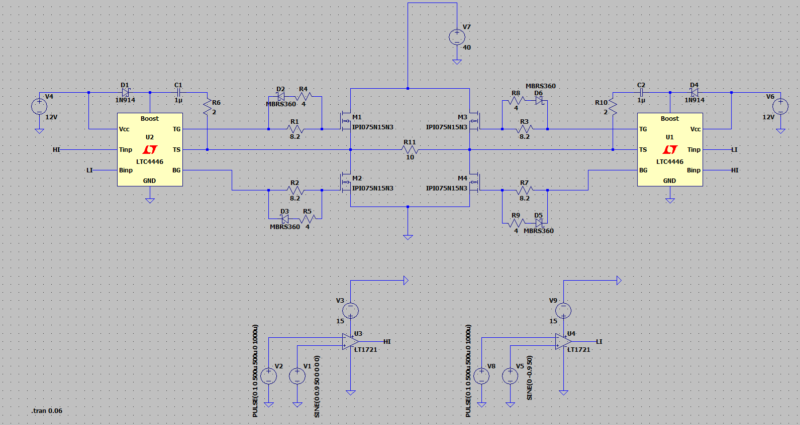
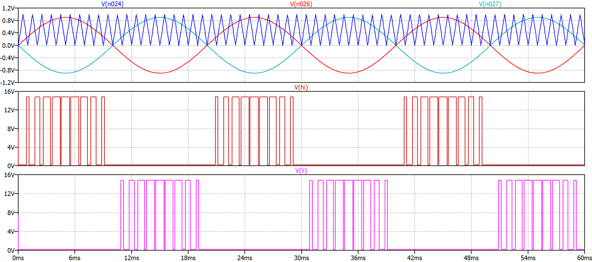
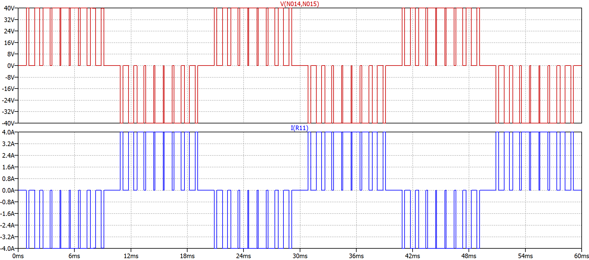
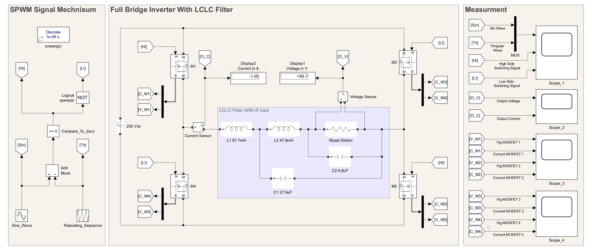
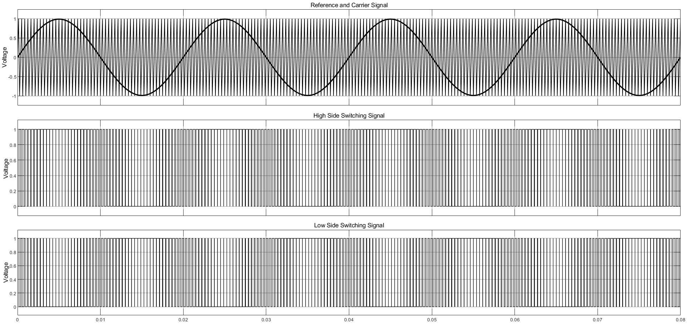
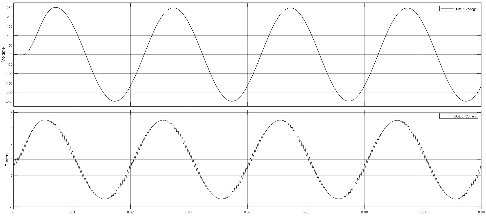
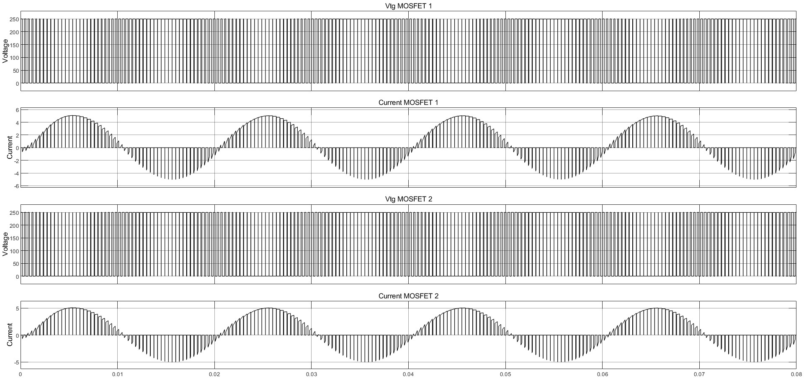
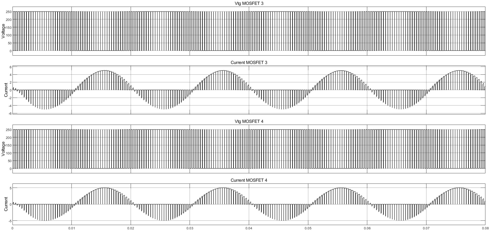

# Single-Phase H-Bridge Inverter Simulation

This repository contains a transient simulation of a single-phase H-bridge inverter circuit built and tested in LTspice. 

The project demonstrates the conversion of a DC voltage source into an AC output using Sinusoidal Pulse Width Modulation (SPWM) control logic and real gate driver circuit characteristics.

## Circuit Features & Parameters
- **Topology:** Full H-Bridge inverter using 4 power MOSFET switches.
- **Control Strategy:** Sinusoidal Pulse Width Modulation (SPWM).
- **Simulation Run Time:** 600 ms (Steady-state achieved).
- **Output Target:** Pure/Filtered alternating current (AC) across an inductive load.

## Control Logic: SPWM (Sinusoidal PWM)
The switching signals for the high-side and low-side MOSFETs are generated by comparing:
1. A low-frequency **reference sine wave** (representing the desired output AC frequency, e.g. 50Hz).
2. A high-frequency **triangular carrier wave** (dictating the switching frequency of the inverter, e.g. 1000Hz).

The overlap between these two waves controls the width of the pulses delivered via the gate driver circuit to turn the diagonally opposite switches ($S_1, S_4$ and $S_2, S_3$) on and off.

## Key Simulation Waveforms
| **Pulse Parameter** | **V2** | **V8** | **Sine Parameter** | **V1** | **V5** |
|---------------------|:------:|:------:|--------------------|:------:|:------:|
| Initial Voltage (V) | 0 | 0 | DC Offset (V) | 0 | 0 |
| ON Voltage (V) | 1 | 1 | Amplitude (V) | 0.9 | 0.9 |
| Delay (s) | 0 | 0 | Frequency (Hz) | 50 | 50 |
| Rise Time (µs) | 500u | 500u | Delay (s) | 0 | 0 |
| Fall Time (µs) | 500u | 500u | Theta (1/s) | 0 | 0 |
| ON Time (s) | 0 | 0 | Phase (deg) | 0 | 0 |
| Period (µs) | 1000u | 1000u | Ncycles | 0 | 0 |
| Ncycles | - | - | | | |

### 1. Schematic


### 2. SPWM Generation Logic

*Showing the intersection of the reference sine wave and triangular carrier wave alongside the gate control pulses.*

### 3. Load Output Voltage and Current

*Showing the chopped output voltage and the filtered, sinusoidal load current waveform.*

## How to Run the Simulation
1. Download or clone this repository.
2. Open the `.asc` file directly in **LTspice**.
3. Click the **Run** (Running Man) icon to execute the 600ms transient analysis.
4. Click on the load to observe the current or measure differentially across the load terminals to view the voltage.

## MATLAB / Simulink Implementation

This section contains a parallel implementation of the same single-phase H-bridge inverter, built and simulated in **MATLAB Simulink**, to cross-verify the SPWM control logic and output waveform behavior obtained in LTspice.

### Model Features
- **Topology:** Full H-Bridge using 4 ideal/IGBT (or MOSFET) switch blocks, driven by Simulink's Simscape Power Systems (Specialized Power Systems) library.
- **Control Strategy:** Sinusoidal PWM generated using a Repeating Sequence (triangular carrier) block compared against a Sine Wave (reference) block via a Relational Operator / Comparator.
- **Gate Logic:** Complementary switching pairs (S1,S4 and S2,S3) with dead-time insertion block to prevent shoot-through.
- **Simulation Solver:** ode23tb (stiff/TR-BDF2), suitable for switching power electronics models.
- **Output Target:** Filtered sinusoidal voltage/current across an RL or inductive load, using a second-order LC low-pass filter block.

### Simulink Model Structure
| Block | Function |
|---|---|
| Sine Wave | Reference signal (50 Hz, defines fundamental output frequency) |
| Repeating Sequence / Triangle Generator | Carrier signal (e.g. 1 kHz, defines switching frequency) |
| Relational Operator | Compares reference vs carrier to generate SPWM pulses |
| NOT Gate | Generates complementary gate signal for lower switch |
| H-Bridge (4x Switch/IGBT blocks) | Power stage |
| LC Filter | Removes switching harmonics from chopped output |
| Scope / To Workspace | Captures gate pulses, chopped voltage, and filtered output |

### Simulink Model Diagram

*Full model layout: SPWM signal generation (sine + triangle + comparator + NOT gate), the full-bridge inverter (M1–M4) built around a 250 Vdc source, the LCLC output filter with resistive load, and the measurement/scope subsystem feeding four scopes (gate signals, output V/I, and per-MOSFET voltage/current).*

### Simulation Results

### SPWM Reference, Carrier & Gate Switching Signals

*Top: 50 Hz reference sine overlaid on the triangular carrier. Middle: resulting high-side gate switching signal. Bottom: complementary low-side gate switching signal.*

### Filtered Output Voltage and Current

*Output voltage (≈250 V peak) and load current (≈5 A peak) after the LCLC filter, showing a clean sinusoidal shape at 50 Hz with visible residual switching ripple on the current.*

### MOSFET 1 & 2 Gate Voltage and Device Current

*Gate pulse train (Vtg) and corresponding conduction current for M1 and M2 — the diagonal switch pair conducting during the positive half-cycle group.*

### MOSFET 3 & 4 Gate Voltage and Device Current

*Gate pulse train (Vtg) and corresponding conduction current for M3 and M4 — the complementary diagonal switch pair, conducting 180° out of phase with M1/M2.*

### How to Run
1. Open MATLAB (R2021a or later recommended for Simscape Power Systems compatibility).
2. Open the `.slx` model file.
3. Set simulation stop time (e.g. `0.6` s to match the LTspice 600 ms run).
4. Click **Run**.
5. Use the Scope blocks to observe SPWM gate pulses, unfiltered chopped output, and filtered sinusoidal load voltage/current.

### Files
- `hbridge_spwm_model.slx` — Simulink model
- `spwm_params.m` — Script to initialize carrier frequency, modulation index, and reference frequency variables before running the model

---

## Python: SPWM Signal Generation

This section contains a standalone **Python script** that generates the SPWM gate control signal only — i.e., it reproduces the logic shown in the "SPWM Generation Logic" waveform above (reference sine vs triangular carrier vs resulting pulse train), without simulating the power stage itself.

### Purpose
Useful for quickly visualizing/verifying SPWM pulse generation logic (duty cycle variation, modulation index effect, carrier/reference frequency ratio) before implementing it in LTspice or Simulink, or for offline waveform analysis.

### Parameters Used
| Parameter | Symbol | Value |
|---|:---:|---|
| Reference frequency | f_ref | 50 Hz |
| Carrier frequency | f_carrier | 1000 Hz |
| Modulation Index | m_a | 0.9 (Amplitude / Carrier Amplitude) |
| Sampling rate | f_s | e.g. 1 MHz (for smooth resolution) |

### Script Overview
- Generates a reference sine wave: `V_ref(t) = m_a * sin(2*pi*f_ref*t)`
- Generates a triangular carrier wave at `f_carrier` using `scipy.signal.sawtooth` (triangle mode).
- Compares sample-by-sample: `SPWM_pulse = 1 if V_ref(t) > V_carrier(t) else 0`
- Plots reference, carrier, and resulting pulse train using `matplotlib`.

### Files
- `spwm_generate.py` — Main script
- `requirements.txt` — `numpy`, `scipy`, `matplotlib`

### How to Run
```bash
pip install -r requirements.txt
python spwm_generate.py
```
Output: A plot window showing the reference sine, triangular carrier, and generated SPWM pulse train (matches Section 2 waveform above, generated independently in Python).
